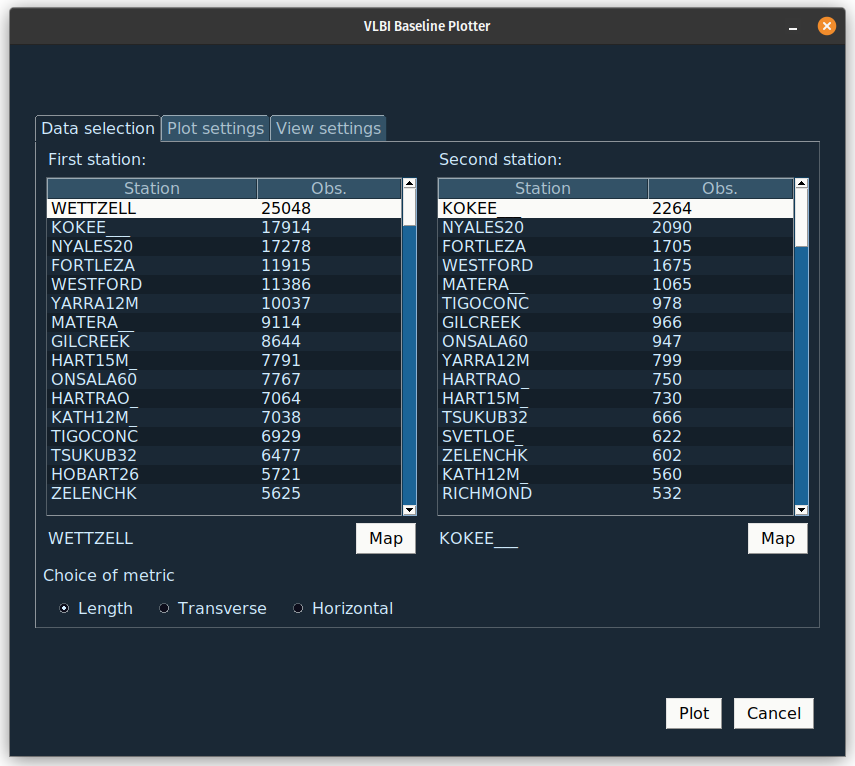

# VLBI Baseline Movement Plotter

## Description

Plots the length and other related quantities between two VLBI stations. The program was developed at NVI Inc. by Filip Herbertsson and Samuel Collier Ryder during a summer internship in 2023.




## How to install

To install the program, you need to clone the GitHub repository and install the required libraries manually with

```bash
$ git clone https://github.com/SamuelCr99/VLBI_baseline_movement_plotter.git
$ pip install pandas matplotlib PySimpleGUI Pillow
```

## How to use

The program has three plots it can produce: A scatter plot of the data with a trend line, a plot of residuals from the trend line and a plot displaying the standard deviation from the trend line, averaged over some interval. The program can either be used with the provided GUI, or it can be run as a script.

### GUI mode

While in the root folder of the project, you can start the GUI with

```bash
$ python3 baseline_plotter.py
```

There are three tabs in the window: __Data selection__, __Plot settings__ and __View settings__.

1. In __Data selection__, you choose which stations you want to plot the baseline between and what metric of the baseline you want to plot. Station selection can either be done through the lists, or using the a map which can be opened with the "Map" button. When selecting the second station, you will see a number beside the name of each station representing the amount of sessions in the data that contains both stations. It is advised to choose stations that have as many sessions in common as possible. It is possible to order the list after this number, or in alphabetical order.
2. In __Plot settings__, you choose which plots you want to produce and what data they should contain.
3. In __View settings__, you choose if you want to display the plots and/or if you want to save the plots. It is possible to only save the plots without displaying them, or vice versa, or both displaying and saving them. Saved plots will be stored in the "plots" directory.

When you have made all the necessary choices, you can go ahead and plot the data using the "Plot" button. If you want to plot more things, you are free to either close the old plots before or leave them.

### Script mode

The plotter can be used in script mode with

```bash
$ python3 baseline_plotter.py <station1> <station2> <flag1> ... <flagN>
```

 Example: 
 ```bash
$ python3 baseline_plotter.py KOKEE___ WETTZELL --show_plots --no_trendline
 ```
 
 All available flags can be found using: 
 ```bash
 $ python3 baseline_plotter.py --help 
 ```

### Change data

If you want to change the data being plotted and add more sessions, you can do so by switching out the data/raw_data.csv file. The file is delimited by whitespace and the necessary columns are "year", "locations", "length", "length_sigma", "transverse", "transverse_sigma", "horizontal", "horizontial_sigma".

If the new data contains more stations, be sure to include them and their positions in the data/position.csv file. Otherwise, they can't be viewed on the map.

## Known problems and limitations
* The locations of some stations is not currently included in the position.csv file, and thus can not be selected from the map.
* Currently, the flag to exclude raw data will exclude raw data from all plots.