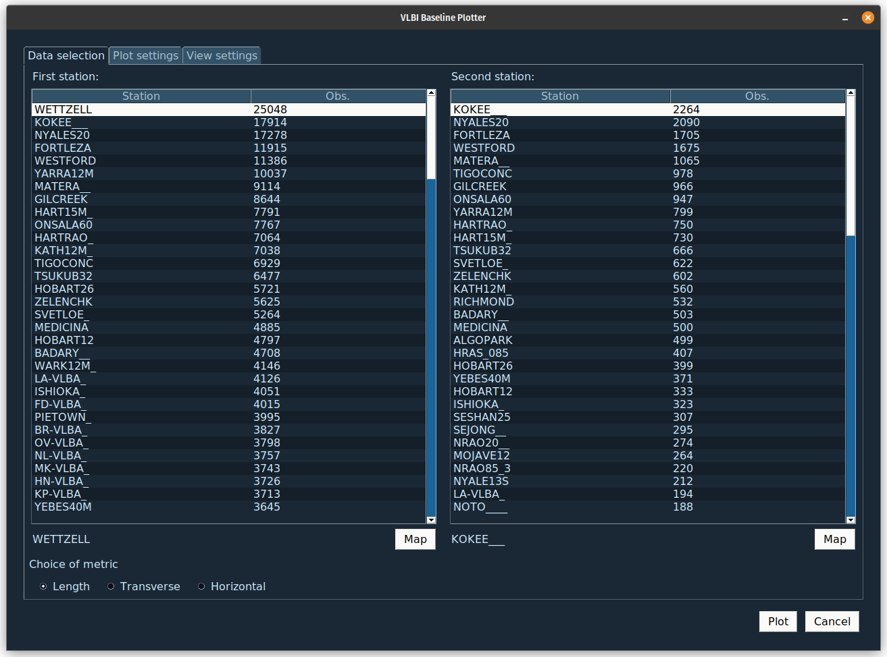

# VLBI Baseline Movement Plotter

## Description

Plots the baseline and other related quantities between two VLBI stations. The program was developed at NVI Inc. by Filip Herbertsson and Samuel Collier Ryder during a summer internship in 2023.




## How to install

To install the program, you need to clone the GitHub repository and install the required libraries manually with

```bash
$ git clone https://github.com/SamuelCr99/VLBI_baseline_movement_plotter.git
$ pip install pandas matplotlib PySimpleGUI Pillow
```

## How to use

The program can either be used with the provided GUI, or it can be run as a script.

### GUI mode

While in the root folder of the project, you can start the GUI with

```bash
$ python3 gui.py
```

There are three tabs in the window: __Data selection__, __Plot settings__ and __View settings__.

1. In __Data selection__, you choose which stations you want to plot the baseline between and what metric of the baseline you want to plot. Station selection can either be done through the lists, or using the a map which can be opened with the "Map" button. When selecting the second station, you will see a number beside the name of each station representing the amount of sessions in the data that contains both stations. It is advised to choose stations that have as many sessions in common as possible. It is possible to order the list after this number, or in alphabetical order.
2. In __Plot settings__, you choose which plots you want to produce and what data they should contain.
3. In __View settings__, you choose if you want to display the plots and/or if you want to save the plots. It is possible to only save the plots without displaying them, or vice versa, or both displaying and saving them. Saved plots will be stored in the "plots" directory.

When you have made all the necessary choices, you can go ahead and plot the data using the "Plot" button. If you want to plot more things, you are free to either close the old plots before or leave them.

### Script mode

The plotter can be used in script mode with

```bash
$ python3 plot_baseline.py <station1> <station2> <flag1> ... <flagN>
```

 Example: 
 ```bash
$ python3 plot_baseline.py KOKEE___ WETTZELL --show_plots --no_trendline
 ```
 
 All available flags can be found using: 
 ```bash
 $ python3 plot_baseline.py --help 
 ```

 ## Known problems
* If the map is used while plots are displayed the GUI will not update the selected station correctly. To force an update the map button must be pressed twice. 
* When the map is present, the user is still able to press buttons in the main window.